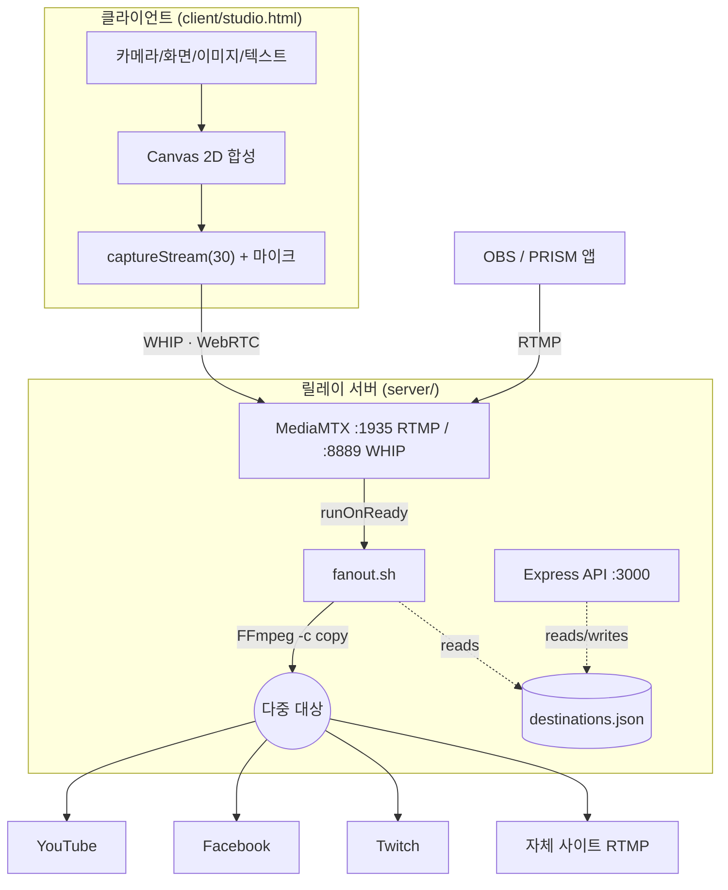

# 아키텍처 — 센트빔 CENTBEAM

> 대상 독자: 이 프로젝트를 처음 여는 엔지니어/AI. 전체 그림 → 데이터 흐름 → 파트별 책임 → 기술 결정 순으로 읽으면 된다.

---

## 1. 시스템 개요

센트빔은 **2파트**로 구성된다. 둘은 오직 **미디어 프로토콜(WHIP/RTMP)**로만 결합한다.



**핵심 아이디어**: 클라이언트는 대역폭을 1배만 쓴다(서버로 1회 송출). N배 fan-out은 서버가 데이터센터 대역폭으로 처리한다.

---

## 2. 데이터 흐름 (한 번의 방송)

1. 사용자가 스튜디오에서 소스를 배치하고 **방송 시작**을 누른다.
2. 클라이언트가 `canvas.captureStream(30)` + 마이크 트랙으로 `MediaStream`을 만든다.
3. WHIP(HTTP POST SDP)로 `http://<host>:8889/<avatar>/whip` 에 publish → MediaMTX와 WebRTC 세션(DTLS-SRTP 암호화) 성립.
4. MediaMTX가 해당 path에 스트림이 준비되면 `runOnReady`로 `fanout.sh <avatar>` 실행.
5. `fanout.sh`가 `destinations.json`에서 그 아바타의 대상 목록을 읽어, 각 대상마다 `ffmpeg -re -i rtmp://127.0.0.1:1935/<avatar> -c copy -f flv <rtmpUrl>/<streamKey>` 를 백그라운드로 띄운다.
6. 스트림이 끊기면 `runOnNotReady`가 `fanout-<avatar>-*` FFmpeg들을 정리한다.

> 재인코딩이 없다(`-c copy`). CPU 부하는 낮지만, **입력 인코딩 = 모든 대상의 출력 인코딩**이다. 대상별로 다른 해상도/비트레이트가 필요하면 재인코딩 브랜치가 필요하다(로드맵 K203/K204).

---

## 3. 파트별 책임

### 3.1 클라이언트 (`client/studio.html`)
- **책임**: 화면 합성(씬), 소스 관리, 변형(이동/크기/회전), 송출(WHIP), 씬 저장.
- **비책임**: fan-out, 대상 관리의 영속화, 인증서버.
- 내부 모듈 구조는 루트 [README.md §5](../README.md#5-클라이언트-상세--studiohtml) 참고.

### 3.2 릴레이 서버 (`server/`)
- **MediaMTX**: RTMP/WHIP 수신, HLS/WebRTC 재생 엔드포인트, publish 훅.
- **fanout.sh**: 대상별 FFmpeg fan-out.
- **server.js (Express)**: `destinations.json` CRUD + 헬스체크. (미디어는 안 건드림)
- 상세는 루트 [README.md §6](../README.md#6-서버-상세--릴레이) 참고.

---

## 4. 포트 맵

| 포트 | 용도 | 노출 |
|--|--|--|
| 1935 | RTMP 인제스트 (OBS/PRISM/FFmpeg) | 공개(방화벽 오픈) |
| 8889 | WHIP(WebRTC) 인제스트 | 공개 |
| 8888 | HLS 재생 (자체 사이트 임베드용) | 공개 |
| 3000 | Express 관리 API | 프록시 뒤(권장) |

프로덕션(참교육카지노 서버)에서는 **기존 Apache**에 studio vhost를 추가해 443에서 TLS 종단(certbot) → 3000/8888/8889로 리버스프록시. **Caddy는 쓰지 않는다**(Apache가 80/443 선점 중, 충돌 시 사이트 다운). [docs/DEPLOYMENT.md](DEPLOYMENT.md) 참고.

---

## 5. 데이터 모델

### 5.1 destinations.json (서버 진실원본)
```jsonc
{
  "<avatar>": [
    {
      "platform": "youtube | facebook | twitch | custom",
      "name": "표시 이름",
      "rtmpUrl": "rtmp://.../live2",   // 스트림키 제외 베이스 URL
      "streamKey": "xxxx",              // 비밀값
      "locked": true                    // true면 API 삭제 불가(필수 대상 보호)
    }
  ]
}
```

### 5.2 Layer (클라이언트 씬 소스, 런타임)
```jsonc
{
  "id": 1, "type": "camera|screen|image|text|web",
  "x": 960, "y": 540, "w": 1920, "h": 1080, "rot": 0, "z": 0,
  "fill": true, "aspect": 1.777,
  // type별: image→{img,src}, text→{text,font,color}, web→{url,iframe}
}
```

---

## 6. 기술 결정 (2026-07 실측 근거)

| 결정 | 선택 | 이유 |
|--|--|--|
| 릴레이 | MediaMTX v1.19.2 | RTMP/WHIP/HLS 단일 바이너리, publish 훅 내장 |
| fan-out | FFmpeg `-c copy` | 재인코딩 0, CPU 저렴 |
| 클라이언트 | 단일 HTML/Canvas | 빌드 없음 → 폰에서 즉시 열람·PWA화 용이 |
| 인증 | next-auth 4.24.14(예정) | 2026-07 최신 stable, OAuth Auth Code + PKCE(RFC 9700) |
| 프레임워크 | (현재) Vanilla | 로드맵상 Next.js 16.2.10로 이관 검토 |
| 미디어 암호화 | WebRTC DTLS-SRTP | RFC 8826/8827 강제 — 송출 구간 기본 암호화 |

> 검증: `next@16.2.10`, `next-auth@4.24.14`, `express@5.2.1`, `mediamtx v1.19.2`, Node 22 LTS(Node 20은 2026 EOL), WHIP=RFC 9725(Bearer MUST), OAuth BCP=RFC 9700 — 모두 2026-07-16 npm/GitHub/IETF 실측.

---

## 7. 보안 포지션 (요약)

- **확보됨**: WebRTC 송출 구간 암호화(DTLS-SRTP, RFC 8826/8827).
- **미흡(로드맵)**: WHIP Bearer 인증(RFC 9725), 스트림키 암호저장(MASVS-STORAGE), CSP(MDN), OAuth PKCE(RFC 9700), MediaMTX publish 인증.
- 전체 20항목은 체크리스트 **R 섹션(331–350)** 참고.

---

## 8. 확장 포인트

- **대상별 재인코딩**: `fanout.sh`에서 대상 프로파일에 따라 `-c copy` 대신 `-c:v libx264 -b:v ...` 분기.
- **대상 on/off**: `destinations.json`에 `enabled` 필드 + API + 클라이언트 토글.
- **오디오 믹서**: 클라이언트에 WebAudio 그래프 삽입(캔버스 stream과 합성).
- **다중 씬**: 클라이언트 `state`를 `scenes[]`로 확장.
